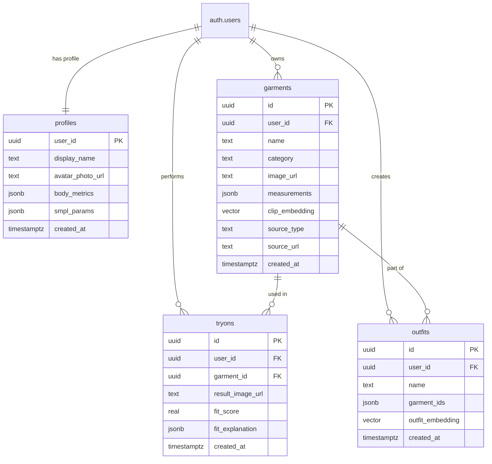

# Database Schema Documentation

This document describes the database schema for ChromaFit, including tables, relationships, and security policies.

## Overview

ChromaFit uses PostgreSQL with Supabase, featuring Row Level Security (RLS) for data protection and vector embeddings for AI-powered features.

## Database Design Principles

- **User-centric**: All data is scoped to authenticated users
- **Secure**: Row Level Security prevents unauthorized access
- **Scalable**: Vector embeddings for AI features
- **Flexible**: JSONB fields for extensible data structures

## Tables

### profiles

User profile information including avatar data and body measurements.

```sql
CREATE TABLE profiles (
  user_id UUID REFERENCES auth.users(id) ON DELETE CASCADE PRIMARY KEY,
  display_name TEXT,
  avatar_photo_url TEXT,
  body_metrics JSONB,
  smpl_params JSONB,
  created_at TIMESTAMPTZ DEFAULT timezone('utc'::text, now()) NOT NULL
);
```

#### Fields

- `user_id`: Primary key, references Supabase auth.users
- `display_name`: User's chosen display name
- `avatar_photo_url`: URL to user's profile photo
- `body_metrics`: JSON object with body measurements
- `smpl_params`: JSON object with SMPL model parameters for 3D avatar
- `created_at`: Timestamp when profile was created

#### Body Metrics Structure

```json
{
  "height": 175,    // cm
  "chest": 92,      // cm
  "waist": 78,      // cm
  "hips": 95,       // cm
  "weight": 70      // kg (optional)
}
```

#### SMPL Parameters Structure

```json
{
  "shape": [0.1, -0.2, 0.3, ...],  // 10 shape parameters
  "pose": [0.05, -0.1, 0.2, ...]   // 72 pose parameters
}
```

---

### garments

User's wardrobe items with AI-extracted properties.

```sql
CREATE TABLE garments (
  id UUID DEFAULT uuid_generate_v4() PRIMARY KEY,
  user_id UUID REFERENCES auth.users(id) ON DELETE CASCADE NOT NULL,
  name TEXT NOT NULL,
  category TEXT NOT NULL CHECK (category IN (
    't-shirt', 'jeans', 'dress', 'shirt', 'pants', 'shorts', 
    'jacket', 'sweater', 'skirt', 'shoes', 'accessories'
  )),
  image_url TEXT NOT NULL,
  measurements JSONB,
  clip_embedding VECTOR(768),
  source_type TEXT NOT NULL CHECK (source_type IN ('upload', 'url')),
  source_url TEXT,
  created_at TIMESTAMPTZ DEFAULT timezone('utc'::text, now()) NOT NULL
);
```

#### Fields

- `id`: Primary key (UUID)
- `user_id`: Owner of the garment
- `name`: Garment name (user-defined or AI-generated)
- `category`: Garment category (enforced by CHECK constraint)
- `image_url`: URL to garment image
- `measurements`: JSON object with garment measurements
- `clip_embedding`: 768-dimensional vector for style similarity
- `source_type`: How the garment was added ('upload' or 'url')
- `source_url`: Original product URL (if added from URL)
- `created_at`: Timestamp when garment was added

#### Measurements Structure

```json
{
  "chest": 92,        // cm or inches
  "waist": 78,        // cm or inches
  "hips": 95,         // cm or inches
  "length": 70,       // cm or inches
  "sleeve_length": 60, // cm or inches (for tops)
  "inseam": 80,       // cm or inches (for bottoms)
  "unit": "cm"        // "cm" or "inches"
}
```

#### Categories

- `t-shirt`: Casual short-sleeve tops
- `jeans`: Denim pants
- `dress`: One-piece garments
- `shirt`: Formal or casual shirts
- `pants`: Various types of pants
- `shorts`: Short pants
- `jacket`: Outerwear
- `sweater`: Knit tops
- `skirt`: Bottom garments
- `shoes`: Footwear
- `accessories`: Bags, jewelry, etc.

---

### tryons

Virtual try-on results with fit analysis.

```sql
CREATE TABLE tryons (
  id UUID DEFAULT uuid_generate_v4() PRIMARY KEY,
  user_id UUID REFERENCES auth.users(id) ON DELETE CASCADE NOT NULL,
  garment_id UUID REFERENCES garments(id) ON DELETE CASCADE NOT NULL,
  result_image_url TEXT,
  fit_score REAL CHECK (fit_score >= 0 AND fit_score <= 1),
  fit_explanation JSONB,
  created_at TIMESTAMPTZ DEFAULT timezone('utc'::text, now()) NOT NULL
);
```

#### Fields

- `id`: Primary key (UUID)
- `user_id`: User who performed the try-on
- `garment_id`: Garment that was tried on
- `result_image_url`: URL to the try-on result image
- `fit_score`: AI-calculated fit score (0.0 to 1.0)
- `fit_explanation`: JSON object with detailed explanations
- `created_at`: Timestamp when try-on was performed

#### Fit Explanation Structure

```json
{
  "fit": "The garment fits well around your body type with appropriate sizing.",
  "style": "This piece complements your proportions and personal aesthetic.",
  "comfort": "The fabric and cut provide good comfort and freedom of movement."
}
```

---

### outfits

User-created outfit combinations with style embeddings.

```sql
CREATE TABLE outfits (
  id UUID DEFAULT uuid_generate_v4() PRIMARY KEY,
  user_id UUID REFERENCES auth.users(id) ON DELETE CASCADE NOT NULL,
  name TEXT NOT NULL,
  garment_ids JSONB NOT NULL,
  outfit_embedding VECTOR(768),
  created_at TIMESTAMPTZ DEFAULT timezone('utc'::text, now()) NOT NULL
);
```

#### Fields

- `id`: Primary key (UUID)
- `user_id`: Creator of the outfit
- `name`: Outfit name
- `garment_ids`: JSON array of garment IDs in the outfit
- `outfit_embedding`: 768-dimensional vector for style similarity
- `created_at`: Timestamp when outfit was created

#### Garment IDs Structure

```json
["uuid-1", "uuid-2", "uuid-3"]
```

## Storage Buckets

### avatars

Public bucket for user profile photos.

```sql
INSERT INTO storage.buckets (id, name, public) 
VALUES ('avatars', 'avatars', true);
```

**Path Structure:** `{user_id}/avatar.{ext}`

### garments

Public bucket for garment images.

```sql
INSERT INTO storage.buckets (id, name, public) 
VALUES ('garments', 'garments', true);
```

**Path Structure:** `{user_id}/garments/{timestamp}.{ext}`

### tryons

Public bucket for try-on result images.

```sql
INSERT INTO storage.buckets (id, name, public) 
VALUES ('tryons', 'tryons', true);
```

**Path Structure:** `{user_id}/tryons/{timestamp}.{ext}`

## Row Level Security (RLS)

### Profiles

```sql
-- Users can view all profiles
CREATE POLICY "Users can view all profiles" ON profiles
  FOR SELECT USING (true);

-- Users can update their own profile
CREATE POLICY "Users can update their own profile" ON profiles
  FOR UPDATE USING (auth.uid() = user_id);

-- Users can insert their own profile
CREATE POLICY "Users can insert their own profile" ON profiles
  FOR INSERT WITH CHECK (auth.uid() = user_id);
```

### Garments

```sql
-- Users can view all garments
CREATE POLICY "Users can view all garments" ON garments
  FOR SELECT USING (true);

-- Users can manage their own garments
CREATE POLICY "Users can insert their own garments" ON garments
  FOR INSERT WITH CHECK (auth.uid() = user_id);

CREATE POLICY "Users can update their own garments" ON garments
  FOR UPDATE USING (auth.uid() = user_id);

CREATE POLICY "Users can delete their own garments" ON garments
  FOR DELETE USING (auth.uid() = user_id);
```

### Try-ons

```sql
-- Users can view all try-ons
CREATE POLICY "Users can view all tryons" ON tryons
  FOR SELECT USING (true);

-- Users can manage their own try-ons
CREATE POLICY "Users can insert their own tryons" ON tryons
  FOR INSERT WITH CHECK (auth.uid() = user_id);

CREATE POLICY "Users can update their own tryons" ON tryons
  FOR UPDATE USING (auth.uid() = user_id);

CREATE POLICY "Users can delete their own tryons" ON tryons
  FOR DELETE USING (auth.uid() = user_id);
```

### Outfits

```sql
-- Users can view all outfits
CREATE POLICY "Users can view all outfits" ON outfits
  FOR SELECT USING (true);

-- Users can manage their own outfits
CREATE POLICY "Users can insert their own outfits" ON outfits
  FOR INSERT WITH CHECK (auth.uid() = user_id);

CREATE POLICY "Users can update their own outfits" ON outfits
  FOR UPDATE USING (auth.uid() = user_id);

CREATE POLICY "Users can delete their own outfits" ON outfits
  FOR DELETE USING (auth.uid() = user_id);
```

## Storage Policies

### Avatar Images

```sql
-- Avatar images are publicly accessible
CREATE POLICY "Avatar images are publicly accessible" ON storage.objects
  FOR SELECT USING (bucket_id = 'avatars');

-- Users can manage their own avatars
CREATE POLICY "Users can upload their own avatar" ON storage.objects
  FOR INSERT WITH CHECK (
    bucket_id = 'avatars' AND 
    auth.uid()::text = (storage.foldername(name))[1]
  );
```

### Garment Images

```sql
-- Garment images are publicly accessible
CREATE POLICY "Garment images are publicly accessible" ON storage.objects
  FOR SELECT USING (bucket_id = 'garments');

-- Users can manage their own garments
CREATE POLICY "Users can upload their own garments" ON storage.objects
  FOR INSERT WITH CHECK (
    bucket_id = 'garments' AND 
    auth.uid()::text = (storage.foldername(name))[1]
  );
```

### Try-on Images

```sql
-- Try-on images are publicly accessible
CREATE POLICY "Try-on images are publicly accessible" ON storage.objects
  FOR SELECT USING (bucket_id = 'tryons');

-- Users can manage their own try-ons
CREATE POLICY "Users can upload their own try-ons" ON storage.objects
  FOR INSERT WITH CHECK (
    bucket_id = 'tryons' AND 
    auth.uid()::text = (storage.foldername(name))[1]
  );
```

## Indexes

### Performance Optimization

```sql
-- Garments indexes
CREATE INDEX idx_garments_user_id ON garments(user_id);
CREATE INDEX idx_garments_category ON garments(category);

-- Try-ons indexes
CREATE INDEX idx_tryons_user_id ON tryons(user_id);
CREATE INDEX idx_tryons_garment_id ON tryons(garment_id);

-- Outfits indexes
CREATE INDEX idx_outfits_user_id ON outfits(user_id);
```

## Functions and Triggers

### Auto-create Profile

```sql
-- Function to handle new user profile creation
CREATE OR REPLACE FUNCTION public.handle_new_user()
RETURNS trigger AS $$
BEGIN
  INSERT INTO public.profiles (user_id, display_name)
  VALUES (new.id, new.email);
  RETURN new;
END;
$$ LANGUAGE plpgsql SECURITY DEFINER;

-- Trigger to automatically create profile for new users
CREATE TRIGGER on_auth_user_created
  AFTER INSERT ON auth.users
  FOR EACH ROW EXECUTE PROCEDURE public.handle_new_user();
```

## Extensions

### Required Extensions

```sql
-- UUID generation
CREATE EXTENSION IF NOT EXISTS "uuid-ossp";

-- Vector operations for AI embeddings
CREATE EXTENSION IF NOT EXISTS "vector";
```

## Data Relationships



## Migration Strategy

### Version 1.0 (Current)

- Basic tables with essential fields
- RLS policies for security
- Vector embeddings for AI features
- Storage buckets for file management

### Future Versions

- **v1.1**: Add user preferences and settings
- **v1.2**: Implement outfit sharing and social features
- **v1.3**: Add advanced analytics and insights
- **v2.0**: Multi-tenant support for brands/retailers

## Backup and Recovery

### Automated Backups

Supabase provides automated daily backups with point-in-time recovery.

### Manual Backup

```bash
# Export schema
pg_dump --schema-only > schema.sql

# Export data
pg_dump --data-only > data.sql
```

## Monitoring and Maintenance

### Performance Monitoring

- Monitor query performance with Supabase dashboard
- Track storage usage and API calls
- Set up alerts for unusual activity

### Maintenance Tasks

- Regular index maintenance
- Cleanup of orphaned storage objects
- Archive old try-on results
- Monitor vector embedding storage usage

## Security Considerations

- All sensitive data encrypted at rest
- RLS prevents unauthorized data access
- Input validation on all endpoints
- Secure file upload handling
- Regular security audits recommended
